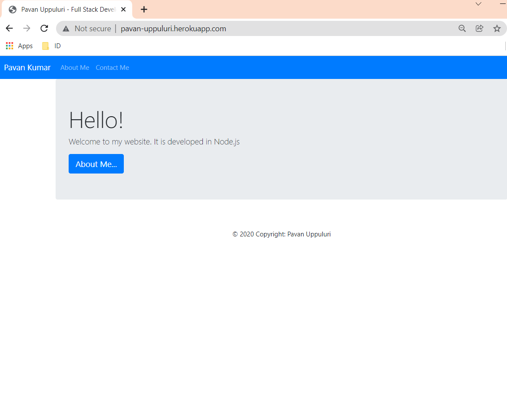

# node-website
This repo contains code of a personal website developed in Node.js and deployed on Heroku.

**Node.js concepts used**
* http server
* fs module
* url module 

**Others**
* Bootstrap for styling
* JavaScript

<b>Home Page</b>
  

**Demo**

https://user-images.githubusercontent.com/63893920/149659683-d29373f8-a184-416d-b1de-4352f9186ee9.mp4

**Heroku Deployment Steps**

* Install Heroku CLI on ubuntu
  * sudo snap install --classic heroku
* Open ubuntu termial and execute below commands
  * heroku login
* Go to project folder and initialize git and execute below commands
  * git init
  * heroku git:remote -a node-website-pavan-uppuluri
  * git add .
  * git commit -am "Node website"
  * git push heroku master
* We can rename the url using
  * heroku rename some_other_name_you_want
